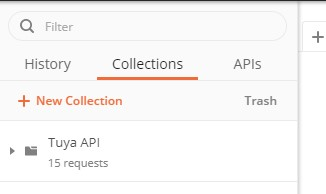
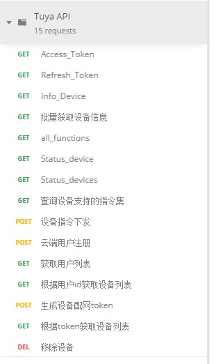
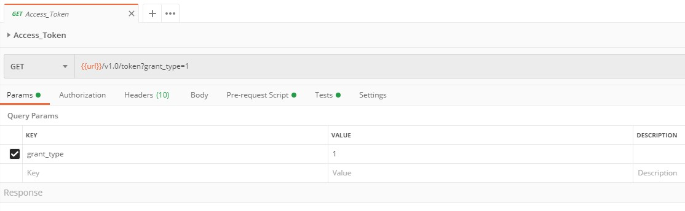
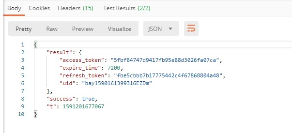
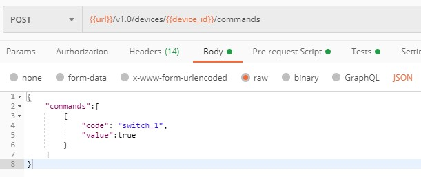
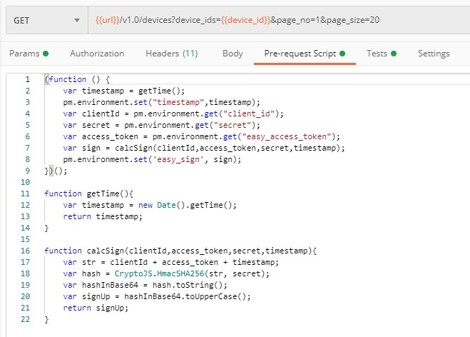

# Comment utiliser POSTMAN pour consommer les devices Tuya

Il s'agit en gros d'une explication / traduction de la [page officielle de Tuya](https://docs.tuya.com/en/iot/open-api/quick-start/quick-start1?id=K95ztz9u9t89n). J'ai rencontré quelques points de blocages lors de mes tests ne connaissant pas l'application.

Donc première étape, il faut installer l'application POSTMAN sur son ordinateur. Vous trouverez l'installeur sur le [site officiel de POSTMAN](https://www.postman.com/).

Téléchargez les deux packages proposés sur le site de Tuya pour configurer rapidement votre application :
1. [Interface Package](https://images.tuyacn.com/smart_res/developer_default/OpenAPI_postman_collection.zip)
[2. Environnement Package](https://images.tuyacn.com/smart_res/developer_default/OpenAPI_postman_environment.zip)

Importez les deux fichiers une fois décompressé.

Mettez à jour les informations avec vos propres données en cliquant sur l’icône de configuration

URL : remplacez avec l'URL Europe (https://openapi.tuyaeu.com)
Client ID et Secret sont les clés de votre application
Device ID : ID trouvé dans l'application.

Les autres variables sont dynamiques, ne pas les toucher. Sauvegardez et quittez.

Dans le menu de gauche, il y a un onglet "**Collection**". Si vous avez importé correctement les fichiers vous devriez trouver une collection avec des caractères chinois. Je l'ai renommé en Tuya API.

À l'intérieur, il y a l'ensemble des services disponibles. Également en chinois, vous pouvez les renommer.

Petite astuce qui m'a coûté du temps, il faut choisir l'environnement en haut à droite ! Il y a une liste déroulante juste avant l'icône de configuration. Choisissez le nouvel environnement disponible à la place de "No Environment".

C'est bon ! Configuration terminée ! 

Il faut lancer en premier le premier service de la liste qui permet de s'authentifier auprès du cloud Tuya.

Après l'exécution les précédents variables dynamiques seront remplies correctement et il est maintenant possible de requêter le device.

## Les services GET
* {{url}}/v1.0/devices/{{device_id}} : retourne les informations (dont la local key) de votre device
* {{url}}/v1.0/devices/{{device_id}}/status : statut du device
* {{url}}/v1.0/devices/{{device_id}}/functions : liste des fonctions que l'on peut envoyer au device

## Le service POST
* {{url}}/v1.0/devices/{{device_id}}/commands : Envoi une commande à votre device (cf. functions). Ici il faut remplir l'onglet Body avec les informations sur la commande

Pour information les autres services POST me retourne "Permission Deny" et je n'ai pas cherché plus loin ayant tout ce dont j'ai besoin.

Il suffit par la suite d'implémenter un script / programme qui automatise les requêtes pour vous. 

## Authentification 
Juste quelques informations concernant l'obtention d'une token.
Il s'agit d'un script que l'on peut analyser dans POSTMAN.

Il utilise SHA256 mais l'encodage est différent lors d'une requête pour la token ou lorsqu'on consomme un service une fois authentifié.

* Pour la token : client_ID + timestamp
* pour le reste : client_ID + token + timestamp

