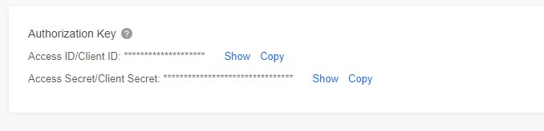
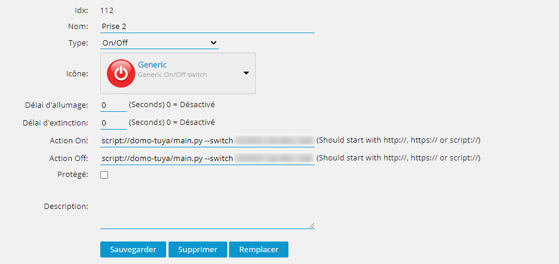

# Domoticz Tuya

Another way to integrate your switch Tuya to Domoticz

## What is it?
### Step 1 - Get Keys & Link your account
I have discover this method on [Tuyapi Repo](https://github.com/codetheweb/tuyapi/blob/master/docs/SETUP.md). 
Unfortunatly this tutorial did not work well for me and even if I was able to add the devices on my Domoticz server I was not able use them.
After digging a bit I have found few clues and I work on my own solution. 
Perhaps it exists already something like mine.

1. This method requires you to create a developer account on [iot.tuya.com](https://iot.tuya.com). 
2. Register the devices within the Tuya App ([Android](https://play.google.com/store/apps/details?id=com.tuya.smart&hl=fr) or [IOS](https://apps.apple.com/fr/app/tuyasmart/id1034649547)). 
3. After you've created a new account, click "**Cloud Development**" in the top nav bar and click "**Create**".  After you've created a new application, click into it.  The access ID and access key are equivalent to the API key and API secret values need.)
4. From there the solution is a bit different. On the left pan you can see a menu. Click on "**Linked Devices**". On the new page, click on tab "**Link devices by App Account**". Grab your phone and go to "**Profil**" select the "**Scan**" icon on the top rigth. On the web page click on "**Add App Account**" and scan the QR code. Your account is now linked to the "_Tuya Cloud_"

### Step 2 - Configure the application
In the folder you will find a file `code.json.model`. You have to rename it in `code.json`and add your application id and your client id.

`{
   "devices":{
      "prise_a":"",
      "prise_b":""
   },
   "client_id":"",
   "app_id":""
}`

Devices is an option added just for memory at this moment. Because to call the script you will need to use these values to toggle the correct switch. These ids are available within the application in Information > Virtual ID. You have to do it on each device.

### Step 3 - Play with it
This python script send request in Tuya Cloud and allow you to switch the device and also to get status of the device.

The python script is just a wrapper and allow you to send the request. 

`Options available
main.py --switch <ID> <True|False>
main.py --status <ID>
main.py --toggle <ID>`

## Installation 

Go to script folder of your installation and clone the repo.

`git clone https://github.com/BreizhCat/domoticz-tuya.git `

Change authorization
`chmod a+x main.py`

Update the configuration file as expected (cf. Configure Application above).

In Domoticz, create dummy switch and add the action on and off on it.

